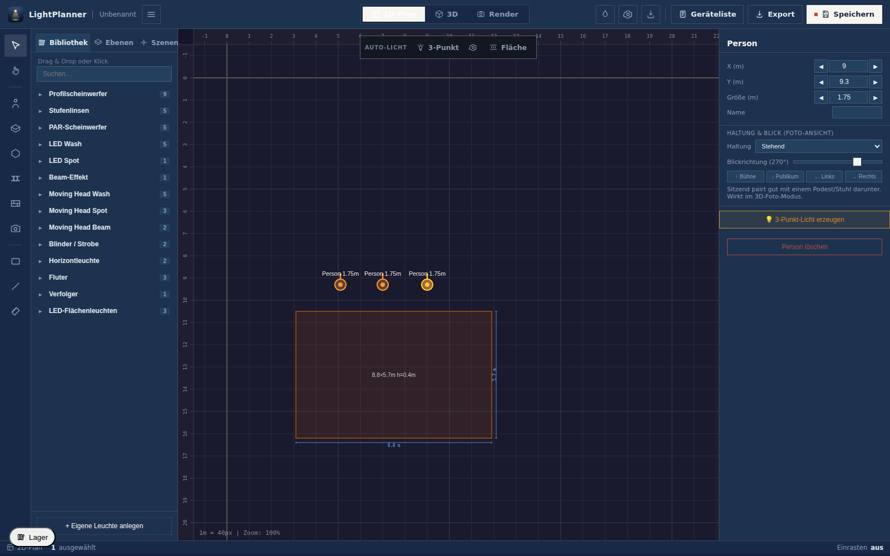

<h1 align="center">💡 LightPlanner</h1>

<p align="center">
  A quick lighting sketch — without paper
</p>

<p align="center">
  
  
  
  
  
  
</p>

<p align="center">
  
</p>

---

## ✨ What it is

**LightPlanner** is a small desktop app for quickly sketching out a lighting setup.
The kind of plan you'd otherwise scribble on the back of a call sheet — just on a 2D canvas with a little 3D preview on top.

It is **not** a replacement for Vectorworks, or Capture. It's the tool you reach for when you just want to think through where the lights go before you start rigging.

✔ Runs offline on macOS & Windows
✔ Drop in fixtures, drag the aim point, see roughly where the light lands
✔ Save the plan as a single file and move on

---

## 🧰 What's in it

### 🗺️ 2D plan view
- Pan / zoom canvas with a metre grid
- Drop fixtures, drag them around, drag the aim point
- Multi-select, group, undo / redo
- Stick a stage, a podium or a person on the floor for reference

### 📐 Import a building plan
- Drop in a floor plan as **JPG, PNG or PDF** (multi-page PDFs let you flip between pages)
- **Calibrate the scale**: drag a line along something you know the length of (a wall, a scale bar), type the real distance, and the whole plan snaps to the right size
- Nudge it into place, dial the opacity down, and lock it so you don't move it by accident
- Now everything you draw on top is to scale

### 🧊 3D preview
- A simple Three.js view of the room with the cones drawn in
- Useful to sanity-check angles and heights
- Screenshot button for sharing

### 🔆 Lux heatmap
- A rough lux estimate on the floor based on the fixtures' photometric data
- Switch on a target value to colour the floor by under / on / over
- Not a replacement for a real photometric study — close enough for a sketch

### 🎚️ A fixture & gel library
- Source Fours, PARs, Fresnels, LED panels and a few moving heads
- Current Elation LED range built in — KL Fresnel 8 FC, KL Panel, KL Profile FC, KL PAR FC, Fuze, …
- LEE & Rosco CTO / CTB / frost gels
- Add your own custom fixture — or **let the AI pull the specs from a datasheet** (paste the text, it fills the photometric/beam/power fields and shows where each value came from so you can check it)

### 📋 Patch & paperwork
- Auto-number the rig and auto-patch DMX (universe / address, footprint-aware, with clash detection)
- Equipment list, instrument schedule and an electrical-load summary (kW, A per phase, 16 A circuits) — export to CSV
- Trusses / hanging positions you can draw and label
- **Return from the console**: load the desk's patch export (CSV/TSV) and hold it against the plan — re-addressed, renamed, retyped, only-on-the-desk, only-in-the-plan. One-way on purpose: nothing is written back, because the plan carries the intent and the desk the state after load-in
- **Fixture groups that survive the handover**: name a group, print the group sheet (CSV) with channel, unit, type and position — MVR has no group entity, so the export says so instead of letting you find out at the console. Everything an `.mvr` cannot carry is listed there, computed rather than remembered
- **Exchange files that do not break on a rename**: the `.mvr` is reproducible — the same rig exports to the same bytes, and every fixture keeps its UUID across saves, reloads and machines, so a re-import is an update instead of a duplication. Two fixture types can never share a GDTF file name, and where their names collide only in characters a file name cannot carry, the export says so
- **Merge two copies that drifted apart**: pick the version both sides started from, load the other `.avplan`, and walk a three-way change list — added, deleted, changed, conflict. Nothing is applied without a choice, whole objects are taken rather than fields, and where the deleted-on-one-side-changed-on-the-other case appears it is a conflict, never a silent delete
- **Pre-flight check before anything is hung**: overlapping DMX, duplicate channels, electronics patched as a dimmer load, missing channel or unit numbers — and, unusually, a verdict that includes *cannot be judged*. A plan whose load figures rest on missing weights is not ready; it is unanswered, and the report says which findings rest on assumptions

### 🎬 Auto-place helpers
- One-click 3-point lighting around a person
- "Fill an area evenly" generator for a stage or podium
- Useful starting points — you'll still want to nudge things by hand

### 💾 Save / open · export
- One project file with everything in it — fixtures, trusses, and the calibrated building plan — in local storage, no cloud
- File menu with undo / redo, and export of the current view as PNG, JPG or PDF

---

## 🚀 Getting started

Download the latest release from the [Releases page](https://github.com/larszu/light-planner/releases) — pick the installer or portable build for your platform.

Or run from source:

```bash
npm install
npm run dev          # web preview in the browser
npm run electron:dev # the actual desktop app
```

The dev server binds a fixed port with `strictPort` — the AV Planner Suite
looks for the lighting planner there when it embeds it, so a port that quietly
moves would leave the shell pointing at nothing. The number lives in
`vite.config.ts` and nowhere else: the headless scripts under `scripts/` read
it from there via `scripts/dev-server.mjs`, and `npm run devport:check` fails
the build if any file names a different one. Pass a base URL as the first
argument to point a script somewhere else.

---

## 🧪 Tech

Electron · React · TypeScript · Three.js · Vite · electron-builder.

**Source language:** `en`. The English string in `t('key', 'English text')` is
the source text — it is what appears when a key has no translation, so it is
the text a contributor writes first. Translations live under `src/i18n/`, one
file per language (`de.ts` today).

**Decided on 2026-09-09 (E-28), and it replaces E-17/E-20:** *every* repository
in the suite is English-source. German is the first translation; further
languages of the target audience follow. Before E-28 the source language was a
property of each repository — this one and `cable-planner` were German-source —
which meant a German-only contributor and an English-only one wrote in
different places depending on the repo.

Adding a language touches no logic: drop a `src/i18n/<code>.ts` next to `de.ts`,
register it in `src/i18n/index.ts`, done. `npm run lang:check` measures the
fallbacks, fails on any line in the other language, and separately counts
visible text that was never wrapped at all. The machine-readable copy of this
declaration sits in `package.json` under `avplan.sourceLanguage`.

---

## 📚 Documentation

- [`INTEGRATION.md`](INTEGRATION.md) — how the lighting planner is structured
  for embedding in a host app (Cable-Planner), and exactly what is done versus
  what remains.

`npm run docs:check` fails the build if a Markdown document is not reachable by
links from an entry page. `INTEGRATION.md` was orphaned until 2026-09-04.

---

## ⚠️ Status

Early. Things will change. Use it for sketches, not for paperwork you have to hand in.

---

## 👤 Author

**Lars Zumpe**

---

## ❤️ Coffee?

<p>
  <a href="https://paypal.me/larszumpe">
    
  </a>
</p>

Totally optional — the app stays free to use. It is proprietary software, not open source.

---

## 📄 License

Proprietär — © 2026 Lars Zumpe, alle Rechte vorbehalten. Nutzung der veröffentlichten Builds ist kostenlos; Weiterverbreitung und abgeleitete Werke sind es nicht. Siehe [LICENSE](LICENSE).
